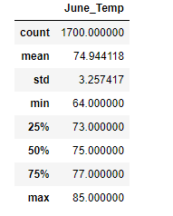
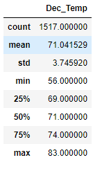

# Surfs Up SQLite Analysis

## Overview of the Analysis

### Purpose
Our purpose for this analysis was further research on the weather patterns in Hawaii to help land funding from our key investor W. Avy for our passion project of opening a surf and shake shop on the island. The investor had previously tried investing in a surf shop but picked a poor location due to the rain, and wanted to see analytics on a weather data set from our targeted island Oahu. For the analysis completed here, we researched temperature data for the months of June and December in Oahu, in order to determine if the surf and ice cream shop business is sustainable year-round.

## Surfs Up Results

### Temperature Analysis Major Points
- As shown in the June and December summary statistics below, the 50% percentile or median is 4 degrees warmer in June than December at 75 compared to 71.
- The mean or average temperature for June is almost 4 degrees warmer in June at 74.9 than December at 71.0 
- It should be noted that the count of recorded June temperatures is higher than the recorded December temperatures by 183 data point entries.
- The minimum temperature for June was 8 degrees higher at 64 than December which was at 56.  



## Surfs Up Analysis Summary

### Temperature Analysis Takeaways and Further Research
The results of the Surfs Up Temperature Analysis show that the location of Oahu would be a quality option to open up the Surf and Shake shop. There is a substantial amount of data collected over multiple years and between the months of June and December the temperature does not drastically change to the point that it would significantly affect the business. The max temperature for both months shows that the weather can even be close as it was only two degrees apart between June and December. The standard deviation was also close to a similar value for each month, and the average temperature was still above 70 degrees for December. For additional weather information on the months of June and December, the first query below shows the precipitation data for each month, where 12 is used for December and 06 for June. The second query is for capturing the most recent full year of data for each month which was 2016. 

```

date_str = "12" / "06" #12 for December and 06 for June

session.query(Measurement.date, Measurement.prcp).\
	filter(func.strftime("%m", Measurement.date) == date_str).all()


date_str = "2017-12" / "06" #12 for December and 06 for June

session.query(Measurement.date, Measurement.tobs).\
	filter(func.strftime("%Y-%m", Measurement.date) == date_str).all()

``` 
